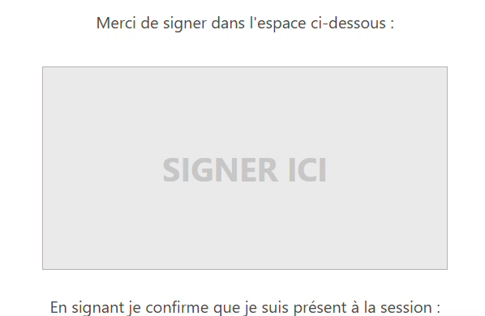

# Draw your dreams on Edusign :)  
  
XMR address for donations: 4AJtFkiynSSiRrzcNeD2PkhRnLvd35zPt1PCng5NCDfAExn9cZ9jPnY6Bc3RkadLPLEyMCa7aWcXyL725mmrZ3BcNdSCYuH  
  
Start by downloading [Chrome](https://www.google.com/intl/fr/chrome/).  
Then:  
run `setup.bat`  
run `run.bat`  

In the DrawBot UI:  
1) Enter the daily signature URL,  
2) Choose your best image (line-art images, like a single line for the outline, work best).  
3) Chose your mode: outline or full image mode.
4) Choose the line thickness.  
5) Choose the drawing size.
6) You can avoid blank pixels if needed.  
7) Click on "Draw on Edusign".
8) Enjoy :)  
  

    
  
